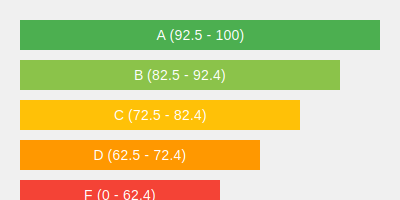

# Grade Calculator

## Overview
This Grade Calculator is a Python-based tool that converts final points to letter grades. It's designed to be user-friendly and efficient, allowing for multiple grade calculations in a single session.

## Features
- Converts numerical grades (0-100) to letter grades (A, B, C, D, F)
- Provides custom messages for top performers and those who need improvement
- Allows for continuous grade calculations until the user decides to stop
- Implements error handling for invalid inputs

## How It Works
1. The program prompts the user to enter a final point value.
2. It then calculates the corresponding letter grade based on the following scale:
   - 92.5 – 100: A (with a "Good job!" message)
   - 82.5 – 92.4: B
   - 72.5 – 82.4: C
   - 62.5 – 72.4: D
   - 0 – 62.4: F (with a "Sorry you fail" message)
3. The program displays the input points and the calculated letter grade.
4. It then asks if the user wants to calculate more grades, continuing the process if desired.

## Usage
To use the Grade Calculator:

1. Ensure you have Python 3.x installed on your system.
2. Run the script in a Python environment (e.g., Jupyter Notebook, command line).
3. Follow the prompts to enter final points.
4. Review the calculated letter grade.
5. Choose to continue with more calculations or end the session.

## Code Structure
The project consists of two main functions:

1. `Letter_grade()`: Handles the grade calculation logic.
2. `main()`: Controls the program flow and user interaction.

## Example
```
What is your final point?: 95.5
Your points: 95.5 Your letter grade is: A, Good JOB!
Do you have more grades to calculate?: yes
What is your final point?: 82.6
Your points: 82.6 Your letter grade is: B
Do you have more grades to calculate?: n
Grade report complete!
```

## Future Enhancements
- Add support for different grading scales
- Implement a graphical user interface (GUI)
- Include functionality to save and load grade reports
